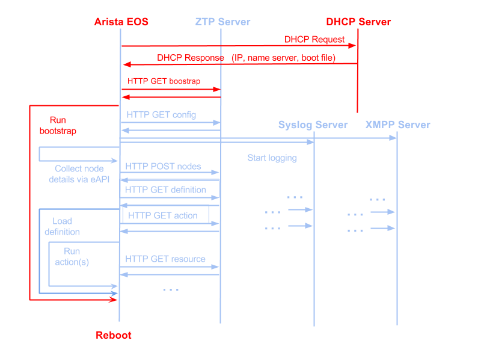

Implementation Details
======================

.. contents:: :local:

Client-Server Message Flows
---------------------------

A high level view of the client - server message flows can be seen in the following diagram: 

.. note::
    Red lines indicate Arista EOS (ZTP) flows.

    Blue lines indicate ZTPServer's bootstrap client's flows.

Client-side implementation details
----------------------------------

Action attributes
~~~~~~~~~~~~~~~~~

The bootstrap script will pass in as argument to the main method of each
action a special object called ‘attributes’. The only API the action
needs to be aware for this object is the ‘get’ method, which will return
the value of an attribute, as configured on the server:

-  the value can be local to a particular action or global
-  if an attribute is defined at both the local and global scopes, the
   local value takes priority
-  if an attribute is not defined at either the local or global level,
   then the ‘get’ method will return **None**

e.g. (action code)

.. code-block:: python

    def main(attributes):
        print attributes.get(‘software_image’)

Besides the values coming from the server, a couple of **special
entries**\ \* (always upper case) are also contained in the attributes
object:

1. ‘NODE’: a node object for making eAPI calls to localhost
   See the :doc:`client` documentation.

.. note::

    Object has other functionality as well and more of it
    could be documented and exposed in the future - this is the only one
    interesting for now.*

e.g. (action\_code)

.. code-block:: python

    def main(attributes):
        print attributes.get(‘NODE’).api_enable_cmds([‘show version’])

Bootstrap URLs
~~~~~~~~~~~~~~

1. DHCP response contains the **URL pointing to the bootstrap script**
2. The location of the bootstrap configuration server is hardcoded in
   the bootstrap script, using the SERVER global variable. The bootstrap
   script uses this base address in order to generate the **URL to use
   in order to GET the logging details**: ``BASE_URL/config`` e.g.

   .. code-block:: ini

       SERVER = ‘http://my-bootstrap-server’   # Note that the transport mechanism is
                                               # included in the URL

3. The bootstrap script uses the SERVER base address in order to compute
   the **URL to use in order to POST the node’s information:**
   ``BASE_URL/config``
4. The bootstrap script uses the ‘location’ header in the POST reply as
   the **URL to use in order to request the definition**
5. **Actions and resources URLs**\ & are computed by using the base
   address in the bootstrap script: BASE\_URL/actions/, BASE\_URL/files/

.. note::

    In future releases, the definition will contain an
    extra optional attribute for each action/resource which could be
    used in order to redirect the bootstrap client to another server in
    order to retrieve that resource. This will enable a more distributed
    model for serving ZTP actions and resources.*

.. |POST FSM| image:: https://raw.githubusercontent.com/arista-eosplus/ztpserver/develop/tree/gh-pages/images/NodeControllerPOST-FSM.png
.. |GET FSM| image:: https://raw.githubusercontent.com/arista-eosplus/ztpserver/develop/tree/gh-pages/images/NodeControllerGET-FSM.png
