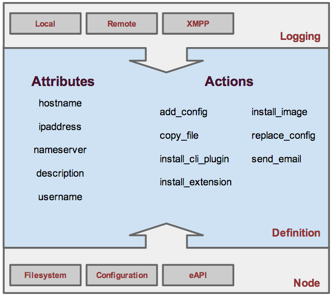
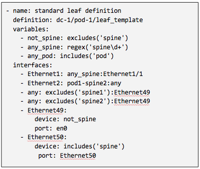

Overview
========

ZTPServer provides a robust server which enables comprehensive bootstrap solutions for Arista network elements.  ZTPserver takes advantage of the the ZeroTouch Provisioning (ZTP) feature in Arista's EOS (Extensible Operating System) which enables a node to connect to a provisioning server whenever a valid configuration file is missing from the internal flash storage.

ZTPServer provides a number of features that extend beyond simply loading a configuration file and a boot image on a node, including: 

* sending an advanced bootstrap client to the node
* mapping each node to an individual definition which describes the bootstrap steps specific to that node
* defining configuration templates and actions which can be shared by multiple nodes - the actions can be customised using statically-defined or dynamically-generated attributes
* implementing environment-specific actions which integrate with external/internal management systems
* validation topology using a simple syntax for expressing LLDP neighbor adjacencies
* enabling Zero Touch Replacement, as well as configuration backup and management

ZTPServer is written in Python and leverages standard protocols like DHCP (DHCP options for boot functions), HTTP(S) (for bi-directional transport), XMPP and syslog (for logging). Most of the configuration files are YAML-based. 

**Highlights:**

* extends the basic capability of ZTP (in EOS) to allow more robust provisioning activities
* is extensible and easy to integrate into any operational environment
* can be run natively in EOS or on a separate server
* is developed by a community lead by Arista's EOS+ team as an open-source project

**Features:**

* automated configuration file generation
* image and file system validation and standardization
* cable and connectivity validation
* topology-based auto-provisioning
* configuration templating with resource allocation (for dynamic deployments)
* Zero Touch Replacement and software upgrade capabilities
* user extensible actions
* XMPP and syslog-based logging and accounting

ZTP Intro
`````````

`Zero Touch Provisioning (ZTP) <http://www.arista.com/en/products/eos/automation/articletabs/0>`_ is a feature in Arista EOS's which, in the absence of a valid startup-config file, enables nodes to be configured over the networks.

The basic flow is as follows:

    * check for startup-config, if absent, enter ZTP mode
    * send DHCP requests on all connected interfaces
    * if a DHCP response is received with Option 67 defined (bootfile-name), retrieve that file
    * if that file is a startup-config, then save it to startup-config and reboot
    * if that file is an executable, then execute it.  Common actions executed this way include upgrading the EOS image, downloading extension packages, and dynamically building a startup-config file.   (**ZTPServer's bootstrap script is launched this way**)
    * reboot with the new configuration

See the `ZTP Tech Bulletin <https://www.arista.com/assets/data/pdf/TechBulletins/Tech_bulletin_ZTP.pdf>`_ and the `Press Release <http://www.arista.com/en/company/news/press-release/345-pr-20110215-01>`_ for more information on ZTP.

Architecture
````````````

There are 2 primary components of the ZTPServer implementation: 

* the **server** or ZTPServer instance **AND**
* the **client** or bootstrap (a process running on each node, which connects back to the server in order to provision the node)

Server
``````


.. image:: _static/Components.png
   :width: 353px
   :align: right

The server can run on any standard x86 server. Currently the only OS-es tested are Linux and MacOS, but theoretically any system that supports Python could run ZTPServer. The server provides a Python WSGI compliant interface, along with a standalone HTTP server. The built-in HTTP server runs by default on port 8080 and provides bidirectional file transport  and communication for the bootstrap process.

The primary methods of provisioning a node are:

* **statically** via mappings between node IDs (serial number or system MAC address) and configuration definitions OR
* **dynamically**  via mapping between topology information (LLDP neighbors) and configuration definitions

The definitions associated with the nodes contain a set of actions that can perform a variety of functions that ultimately lead to a final device configuration. Actions can use statically configured attributes or leverage configuration templates and dynamically allocated resources (via resource pools) in order to generate the system configuration. Definitions, actions, attributes, templates, and resources are all defined in YAML files. 

Client
``````



The client or **bootstrap file** is retrieved by the node via an HTTP GET request made to the ZTPServer (the URL of the file is retrieved via DHCP option 67). This file executes locally and gathers system and LLDP information from the node and sends it back to the ZTPServer. Once the ZTPServer processes the information and confirms that it can provision the node, the client makes a request to the server for a definition file - this file will contain the list of all actions which need to be executed by the node in order to provision itself.

Throughout the provisioning process the bootstrap client can log all steps via both local and remote syslogs, as well as XMPP.

.. _message_flows:

ZTP Client-Server Message Flows
```````````````````````````````

The following diagram show the flow of information during the bootstrap process. The lines in **red** correspond to the ZTP feature in EOS, while the lines in **blue** highlight the ZTPServer operation:

(Red indicates Arista EOS flows.  Blue indicates the bootstrap client.)

.. image:: _static/ztpserver-seqdiag.png
   :alt: Message Flow Diagram


Topology Validation 
```````````````````



ZTPServer provides a powerful topology validation engine via either ``neighbordb`` or ``pattern`` files.  As part of the bootstrap process for each node, the LLDP information received on all ports is sent to the ZTPServer and matched against either ``neighbordb`` or a node-specific ``pattern`` file (if a node is already configured on the server). Both are YAML files that are use a simple format to express strongly and loosely typed topology patterns. Pattern entries are processed top down and can include local or globally-defined variables (including regular expressions). 

Patterns in ``neighbordb`` match nodes to definitions (dynamic mode), while node-specific pattern files are used for cabling and connectivity validation (static mode).

Topology-validation can be disabled:

* globally (``disable_topology_validation=true`` in the server’s global configuration file) OR
* on a per-node basis, using open patterns in the pattern files (see the *Pattern file configuration* section for more details)

Operational modes
`````````````````

There are several operational modes for ZTPServer, explained below.  See :ref:`mode_examples` to see how to use them.

System ID-based provisioning with no topology validation
^^^^^^^^^^^^^^^^^^^^^^^^^^^^^^^^^^^^^^^^^^^^^^^^^^^^^^^^

**Via node-specific folder:**

* a folder corresponding to the node's system ID is created on the server before bootstrap
* a definition file, startup-config file or both is/are placed in the folder 
* topology validation is disabled globally (in the global configuration file) or via an open pattern in the pattern file located in the node-specific folder

**Via neighbordb:**

* a pattern which matches the node's system ID is created in neighbordb before bootstrap
* neighbordb pattern points to a definition file
* neighbordb pattern contains no topology information (LLDP neighbors)
* a node-specific folder with the definition and an open pattern will be created during the bootstrap process

System ID-based provisioning with topology validation
^^^^^^^^^^^^^^^^^^^^^^^^^^^^^^^^^^^^^^^^^^^^^^^^^^^^^

**Via node-specific folder:**

* a folder corresponding to the node's system ID is created on the server before bootstrap
* a definition file, startup-config file or both is/are placed in the folder 
* topology validation is enabled globally (in the global configuration file) and the topology information is configured in the pattern file located in the node-specific folder

**Via neighbordb:**

* a pattern which matches the node's system ID is created in neighbordb before bootstrap
* neighbordb pattern points to a definition file
* neighbordb pattern contains topology information (LLDP neighbors)
* a node-specific folder with the definition and a pattern containing the matched toplogy information will be created during the bootstrap process

Topology-based provisioning
^^^^^^^^^^^^^^^^^^^^^^^^^^^

* a pattern which matches the topology information (LLDP neighbord) is created in neighbordb before bootstrap
* neighbordb pattern points to a definition file
* a node-specific folder with the definition and a pattern containing the matched toplogy information will be created during the bootstrap process
